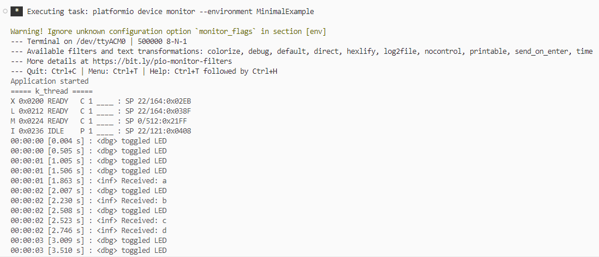
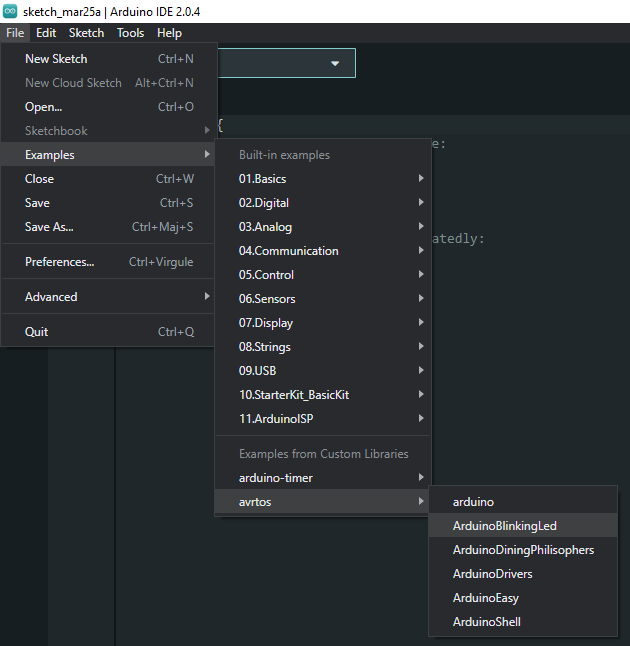
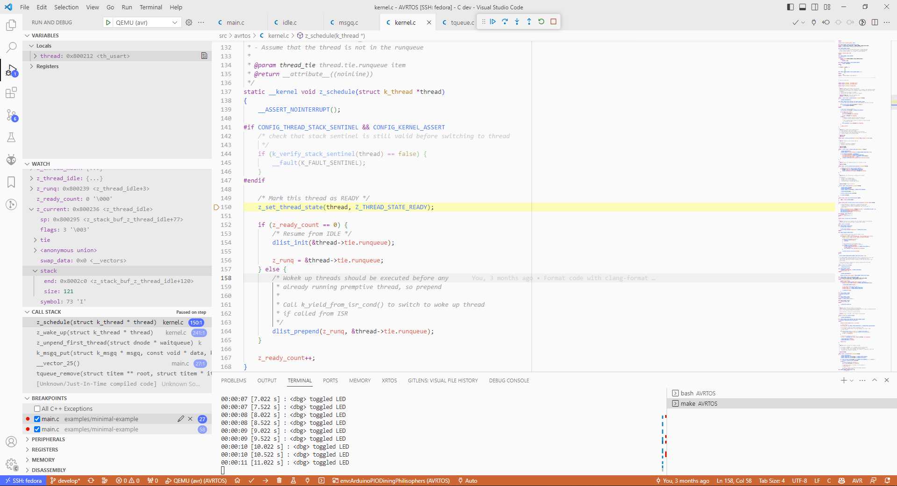

# AVRTOS: An RTOS for 8-bit AVR Microcontrollers

**[Note about rust support in the project](#rust-support)**

## Introduction

AVRTOS is a real-time operating system (RTOS) crafted for 8-bit AVR microcontrollers.
It aims to provide an efficient and highly configurable RTOS solution for AVR-based 
systems. Fully C/C++ compliant, AVRTOS is compatible with the AVR-GCC toolchain, 
Arduino and PlatformIO frameworks, it can even be emulated using QEMU.

AVRTOS has been successfully tested on the following AVR architectures:

- AVR5, particularly ATmega328p
- AVR6, especially ATmega2560

Please bear in mind that as a personal project, it doesn't come with any guarantees.
I hope you find AVRTOS as exciting to use as I found it to develop !

**Please refer to [developer.md](./developer.md) for troubleshooting and development notes.**

## Features

AVRTOS offers an extensive list of features, including:

- Cooperative and preemptive threads
- Naive scheduler without priority support
- Configurable system clock with support for all hardware timers (e.g. 0-2 for ATmega328p and 0-5 for ATmega2560)
- Synchronization objects like mutexes, semaphores, workqueues (+delayables), FIFOs, message queues, memory slabs, flags, signals
- Drivers for UART, timers, GPIO, SPI, I2C and external interrupts
- Devices drivers for TCN75, MCP2515
- Thread sleep with up to 65-second duration in simple mode (extendable using high-precision time objects)
- Scheduler lock/unlock to temporarily prevent preemption for preemptive threads
- Thread switching from interrupts
- Runtime creation for many kernel objects (threads, mutexes, semaphores, workqueues, fifos, memory slabs, ...)
- Diagnostics: Thread canaries and sentinel stack protection
- Events and timers
- Atomic API for 8-bit variables
- Macro-based logging subsystem
- Uptime API
- Data structures: singly and doubly linked lists, queues, ring buffers, timeout queue

Additional Features:

- Thread naming with symbols (e.g., 'M' for the main thread, 'I' for the idle thread)
- Pseudorandom number generator (LFSR)
- Debugging and utility functions  (RAM_DUMP, CORE_DUMP, z_read_ra)
- Kernel assertions (__ASSERT)
- Custom error codes (e.g., EAGAIN, EINVAL, EIO, ENOMEM, ...)
- Thread safe termination (excluding main thread)
- `stdout` redirection to USART0
- Various wait variants (e.g., k_sleep, k_wait with modes IDLE, ACTIVE, BLOCK and z_cpu_block_us)
- Reset reason detection
- Dockerfile and Jenkinsfile templates for CI/CD
- Full compatibility with QEMU emulation

Planned Features (TODOs):

- Comprehensive tests
- Enhanced documentation based on `mkdocs` (and `doxygen` ??)
- Ultra-low duration sleep (e.g., 18us) using a dedicated timer counter with API: `uscounter_init()`, `uscounter_get()`, `uscounter_set`
- Functions like sys_le32_read/write
- Utilizing sysclock for thread wake-up granularity (k_sleep) instead of timeslice
  - Option to select SYSCLOCK or TIMESLICE as the scheduling point (`KERNEL_SCHEDULING_EVENT`)
  - Note on using `k_busy_wait(K_USEC(20u))` for precise short-duration waits
- Thread priority implementation
- Per-thread CPU usage statistics
- Polling mechanisms
- ADC drivers
- Memory heap management
- Runtime detection of available space for the main thread stack (init)
- Consideration of available heap space
- Refactoring: Move or remove unused `AVRTOS_VERSION_MAJOR` variables
- Organize MCU specific fixups and board-specific items in a dedicated "board" directory
- Relocation of assembly files to "arch/avr"
- Consolidation of private defines in _private.h headers
- Investigation of high metric readings
- Tickless kernel + timeslicing features
- Renaming "static inline" functions to "__always_inline"
- Implementation of builtin_ctz for 8-bit variables
- Removal of outdated samples
- Tutorial
- Kconfig to configure the kernel and generate the configuration file
- make the kernel ISR aware with a dedicated ISR stack (can IDLE thread be reused?)
- Sample for discovering the I2C bus
- Doubly linked list implementation for tqueue for optimized removal
- Set `CONFIG_STDIO_PRINTF_TO_USART=0` by default

### Description

Example [minimal-example](examples/minimal-example/main.c) configures an usart, 
and blink a led at a frequency of 1Hz.
Morover, typing a character on the serial console will wake up a thread which
will print the received character.

### Code

Configuration:

```
CONFIG_KERNEL_COOPERATIVE_THREADS=1
CONFIG_KERNEL_TIME_SLICE_US=1000
CONFIG_INTERRUPT_POLICY=1
CONFIG_KERNEL_THREAD_TERMINATION_TYPE=-1
CONFIG_THREAD_MAIN_COOPERATIVE=1
CONFIG_STDIO_PRINTF_TO_USART=0
CONFIG_KERNEL_UPTIME=1
```

Code:
```c
/*
 * Copyright (c) 2022 Lucas Dietrich <ld.adecy@gmail.com>
 *
 * SPDX-License-Identifier: Apache-2.0
 */

#include <avrtos/avrtos.h>
#include <avrtos/debug.h>
#include <avrtos/drivers/gpio.h>
#include <avrtos/drivers/usart.h>
#include <avrtos/logging.h>
#include <avrtos/misc/led.h>
#define LOG_LEVEL LOG_LEVEL_DBG

K_MSGQ_DEFINE(usart_msgq, 1u, 16u);

static void thread_usart(void *arg);
static void thread_led(void *arg);

K_THREAD_DEFINE(th_usart, thread_usart, 164u, K_COOPERATIVE, NULL, 'X');
K_THREAD_DEFINE(th_led, thread_led, 164u, K_COOPERATIVE, NULL, 'L');

ISR(USART0_RX_vect)
{
	const char c = USART0_DEVICE->UDRn;

	k_msgq_put(&usart_msgq, &c, K_NO_WAIT);
}

int main(void)
{
	const struct usart_config usart_config = {
		.baudrate    = USART_BAUD_115200,
		.receiver    = 1u,
		.transmitter = 1u,
		.mode	     = USART_MODE_ASYNCHRONOUS,
		.parity	     = USART_PARITY_NONE,
		.stopbits    = USART_STOP_BITS_1,
		.databits    = USART_DATA_BITS_8,
		.speed_mode  = USART_SPEED_MODE_NORMAL,
	};
	ll_usart_init(USART0_DEVICE, &usart_config);
	ll_usart_enable_rx_isr(USART0_DEVICE);

	led_init();

	LOG_INF("Application started");

	k_thread_dump_all();

	k_stop();
}

static void thread_usart(void *arg)
{
	char c;
	for (;;) {
		if (k_msgq_get(&usart_msgq, &c, K_FOREVER) >= 0) {
			k_show_uptime();
			LOG_INF("<inf> Received: %c", c);
		}
	}
}

static void thread_led(void *arg)
{
	for (;;) {
		k_show_uptime();
		led_toggle();
		LOG_DBG("<dbg> toggled LED");
		k_sleep(K_MSEC(500u));
	}
}
```

Build and flash using PlatformIO. Expected output on the serial console: 



## Configuration

AVRTOS is highly configurable, file [src/avrtos/avrtos_conf.h](./src/avrtos/avrtos_conf.h) lists all the default configuration options.

For arduino framework, a dedicated configuration file is provided in [src/avrtos/avrtos_conf_arduino.h](./src/avrtos/avrtos_arduinoide_conf.h).

## Build

Several build systems are supported:
- Cmake
- Arduino IDE
- PlatformIO (with and without Arduino Framework)

### Arduino IDE

Install the Arduino IDE (1 or 2) from [arduino.cc](https://www.arduino.cc/en/software).

Copy complete `AVRTOS` folder to your Arduino libraries folder.

Open the Arduino IDE and select your board/port.

Select the sample :



Build and upload the sample.

### PlatformIO

### Build, flash and monitor samples

PlatformIO extension for VSCode is recommended (`platformio.platformio-ide`).
Simply select your sample and build it.

### Use AVRTOS as a library dependency in your project

You can clone this repository in your project's `lib` folder, a typical `platformio.ini` file would look like this:

```ini
[env]
platform = atmelavr
board = pro16MHzatmega328
; board = megaatmega2560

upload_port = COM3
monitor_port = COM3
monitor_speed = 115200

build_src_filter = 
	+<AVRTOS/src/>

build_flags = 
    -Wl,-T./avrtos-avr5.xn
    ; -Wl,-T./avrtos-avr6.xn

	-DCONFIG_THREAD_MAIN_STACK_SIZE=256
	-DCONFIG_THREAD_EXPLICIT_MAIN_STACK=0
	-DCONFIG_THREAD_MAIN_COOPERATIVE=1
    	-DCONFIG_KERNEL_SYSCLOCK_PERIOD_US=1000
    	-DCONFIG_KERNEL_TIME_SLICE_US=1000
	; other options ...
```

An example project which uses AVRTOS as a dependency can be found here: [github.com/lucasdietrich/caniot-device](https://github.com/lucasdietrich/caniot-device)

### Cmake

To build the samples with cmake, you'll need to have `avr-gcc`, `avr-gcc-c++`, 
`avr-libc`, `avr-binutils`, `cmake`, `make`, `ninja-build` installed,
`avr-gdb`, `avrdude` and `qemu-system-avr` are optional

To configure your environnement for an Arduino Mega 2560, run the following commands:

```bash
cmake -S . -B build \
  -DCMAKE_TOOLCHAIN_FILE="cmake/avr6-atmega2560.cmake"
```

You can also specify the generator :

```bash
cmake -S . -B build \
  -DCMAKE_TOOLCHAIN_FILE="cmake/avr6-atmega2560.cmake" \
  -DCMAKE_GENERATOR="Unix Makefiles"
```

You can also provide the device where the program will be flashed, this enables 
make commands like `make upload_sample_program`:
```bash
cmake -S . -B build \
  -DCMAKE_TOOLCHAIN_FILE="cmake/avr6-atmega2560.cmake" \
  -DPROG_DEV=/dev/ttyACM0
```

To build the `minimal_example` program, run the following command (Replace `ninja`
with `make` if you specified the `Unix Makefiles` generator) :

```bash
make -C build sample_minimal_example
```

To flash the binary to your device, run the following command:

```bash
make -C build upload_sample_minimal_example
```

Monitor the serial console with `miniterm`:
```bash
BAUDRATE=115200 make monitor
```

### Custom target (Cmake)

In case you have a custom target (e.g. a board not explicitly supported by AVRTOS), 
you can create a custom `avr<version>-<target>.cmake` file and specify it with the `CMAKE_TOOLCHAIN_FILE` option.

A toolchain file has the following structure:

```cmake
set(F_CPU 16000000UL)
set(MCU atmega328p)
set(LINKER_SCRIPT ${CMAKE_CURRENT_LIST_DIR}/../architecture/avr/avrtos-avr5-atmega328p.xn)
set(QEMU_MCU uno)
set(PROG_TYPE wiring) # arduino
set(PROG_PARTNO m328p)

include(${CMAKE_CURRENT_LIST_DIR}/avr.cmake)
```

| Option                        | Description                                                                                                                              |
| ----------------------------- | ---------------------------------------------------------------------------------------------------------------------------------------- |
| `F_CPU`                       | Defines the CPU clock frequency.                                                                                               |
| `MCU`                         | Specifies the target microcontroller unit (MCU) as ATmega328P. See list https://www.nongnu.org/avr-libc/user-manual/using_tools.html     |
| `LINKER_SCRIPT`               | Sets the linker script path for the project. Linker scripts location: [architecture/avr](./architecture/avr)                             |
| `QEMU_MCU` (QEMU only)        | Specifies the target microcontroller unit (MCU) for QEMU simulation as "uno." Can be listed with command `qemu-system-avr -machine help` |
| `PROG_TYPE` (real board only) | Sets the programming type to "wiring." Can be listed with command `avrdude -c help`                                                      |
| `PROG_PARTNO m328p`           | Specifies the target microcontroller part number as "m328p." Can be listed with command `avrdude -c ${PROG_TYPE} -p help`                |
| `FEATURE_TIMER_COUNT`         | Sets the number of 16-bit timers available on the target.                                                              |
| `FEATURE_UART_COUNT`          | Sets the number of UARTs available on the target.                                                                 |
| `include(...)`                | Includes the AVR architecture generic cmake file                                                                                         |

### Custom target (PlatformIO)

In order to describe a custom target with PlatformIO, please refer to the
example `platformio.ini` file from section [Use AVRTOS as a library dependency in your project](#use-avrtos-as-a-library-dependency-in-your-project).


### Run/debug in QEMU

Note about AVR support in QEMU: https://qemu-project.gitlab.io/qemu/system/target-avr.html
You will have limited support for peripherals: all UART are supported, however 
only 16-bit timers are supported.

Moreover you'll need to apply the following patch to QEMU (<= 8.0.2): 
[scripts/patches/0001-Fix-handling-of-AVR-interrupts-above-33-by-switching.patch](./scripts/patches/0001-Fix-handling-of-AVR-interrupts-above-33-by-switching.patch)
to have all 16-bit timers working.

In case you want to emulate you program with QEMU:
```bash
cmake -S . -B build \
  -DCMAKE_TOOLCHAIN_FILE="cmake/avr6-atmega2560.cmake" \
  -DCMAKE_BUILD_TYPE=Debug \
  -DQEMU=ON
```

This enables targets like `run_sample_*` and `qemu_sample_*`.
For example, to run the `minimal-example` program in QEMU, run the following command:

```bash
ninja -C build run_sample_minimal_example
```

To exit QEMU, press `Ctrl+A` and then `x`.

If you want to debug your program with QEMU, run the following command:

```bash
ninja -C build qemu_sample_minimal_example
```

With VS Code, select `QEMU (avr)` configuration, then press `F5` to start debugging (`launch.json` configuration is automatically generated during build).



### Use Makefile

The `Makefile` at the root of the project provides *shortcut* commands to build 
and flash samples.

### Build a sample for QEMU

In order to build the sample `shell` for QEMU run:

	QEMU=ON SAMPLE=shell make

Run it with:

	make run_qemu

Debug it with:

	make qemu

### Build a sample for a custom target

In order to build the sample `drv-timer` for a custom target run:

	TOOLCHAIN_FILE="cmake/avr5-board-caniot-tiny-pb.cmake" SAMPLE="drv-timer" make single

Upload it with:

	make upload

Monitor it with:

	make monitor

### Build in Docker container

Two `Dockerfile` are provided to build the project in a container (based on Fedora)
- [scripts/Dockerfile-base](./scripts/Dockerfile-base) is used as a base image for Jenkins (Devops)
- ~~[scripts/Dockerfile-run](./scripts/Dockerfile-run) is used to build the project directly~~ (deprecated)

Build the container with:

    docker build -t fedora-avr-toolchain -f scripts/Dockerfile-base .

Run the container with (`Z` flag is required with SELinux)

    docker run -it --rm -v $(pwd):/avrtos:Z fedora-avr-toolchain

Build the project within it:

    cd /avrtos
    cmake -S . -B build \
    	-DCMAKE_TOOLCHAIN_FILE="cmake/avr6-atmega2560.cmake" \
	-DCMAKE_BUILD_TYPE=Debug \
	-DQEMU=ON \
	-G="Ninja"
    ninja -C build sample_minimal_example

Run the sample in QEMU:

    ninja -C build run_sample_minimal_example

### Jenkins

A [Jenkinsfile](./Jenkinsfile) is provided to build the project in a Jenkins (multibranch) pipeline.

It is based on the previous Docker container: `devops/fedora-avr-toolchain`

## Rust support

Rust support is currently in development, the goal is to provide a Rust API to
compile rust programs using AVRTOS.

Major steps are:

- Generate rust bindings for the C API using `bindgen`.
- Compile the kernel sources as a static library to link with the rust program, this will take place in the `avrtos-sys` crate.
- Provide an rust idiomatic API to use AVRTOS, this will take place in the `avrtos-core` crate.
- Provide examples to demonstrate the usage of AVRTOS in Rust using a real board and QEMU, this will take place in the `avrtos-examples` crate.
- Extend the support to other boards (e.g. ATmega328p).

External (resources):

- [avr-hal-template](https://github.com/Rahix/avr-hal-template/tree/main)
- [avr-hal](https://github.com/Rahix/avr-hal/blob/main/rust-toolchain.toml)
- [Compiler Weekly: LLVM to AVR](https://schroer.ca/2021/11/07/cw-avr-target/)

Note about current development:

- Sysclock is configured with 100000us period
- Scheduler debug is active
- Only `atmega2560` is supported
- [src/avrtos/rust_helpers.c](src/avrtos/rust_helpers.c) servers development purposes but should behave as a bridge between C and avrtos-core in the future.

### Generate Rust bindings

Script [rust-avrtos-sys/scripts/gen.sh](rust-avrtos-sys/scripts/gen.sh) generates the Rust bindings for the C API. It takes care only `avrtos` API is generated (mainly structures and functions).
The bindgen targets the `atmega2560` cpu variant only, bingen relies on clang which
has a *experimental* support for AVR. Default configuration constants are provided, 
most of the constants are not used by the headers, only constants which enable/disable
a feature are used.

Bindings will end up in [rust-avrtos-sys/src/bindings.rs](rust-avrtos-sys/src/bindings.rs).

TODOs:

- The path to the `avr` headers must be updated to find the system headers automatically.
Maybe the script can be transformed into a CMakelist to generate the bindings during the build process.
- Move default configuration constants to a dedicated header file: [](./src/avrtos/avrtos_rust_conf.h).

### Compile the kernel as a static library

The build script [rust-avrtos-sys/build.rs](rust-avrtos-sys/build.rs) compiles the kernel sources as a static library. It uses the `cc` crate to compile the sources.

Configuration constants must be correct at this stage, as the sources are compiled.

Linker script is provided in [architecture/avr/avrtos-avr6.xn](architecture/avr/avrtos-avr6.xn).

### Provide an idiomatic API

The `avrtos-core` crate will provide an idiomatic API to use AVRTOS in Rust.
The goal is to be to able most of the avrtos features with a fully safe rust API.

### Provide examples

Build current examples with:

- `cargo run --package rust-avrtos-examples --release --bin loop_invalid_assembly`
- `cargo run --package rust-avrtos-examples --release --bin sleep_demo`

Feel free to test the binary by configuring the `runner` in the [.cargo/config.toml](.cargo/config.toml) file:

- The `atmega2560` with `runner = "ravedude -cb 115200 mega2560"` 
- QEMU with `runner = "./scripts/qemu-runner.sh"`, also start debugging with `F5`,
 see [.vscode/launch.json](.vscode/launch.json)

### Current issues

Below are the current issues I'm facing with the Rust support:

#### Compiler

I'm unable to find a correct version for the compiler (see [rust-toolchain.toml](rust-toolchain.toml)):

- `nightly` seems to work but cannot be reproduced.
- `nightly-2024-03-22` which was tested with [avr-hal](https://github.com/Rahix/avr-hal/blob/main/rust-toolchain.toml), doesn't work with `cc` or `bindgen`.
	- Error is exactly described in this [issue (avr-hal: 537)](https://github.com/Rahix/avr-hal/issues/537)

#### Invalid assembly generated

Following example generates invalid assembly:

```rust
#![no_std]
#![no_main]
#![allow(non_upper_case_globals)]
#![allow(non_camel_case_types)]
#![allow(non_snake_case)]
#![allow(dead_code)]

use core::ffi::c_char;

use avrtos_sys::{
    serial_init_baud, serial_print
};
use panic_halt as _;

const boot: &'static str = "avrtos starting\n\x00";

#[arduino_hal::entry]
fn main() -> ! {
    unsafe {
        serial_init_baud(115200);
        serial_print(boot.as_ptr() as *const c_char);
    }

    loop {
    }
}
```

The generated assembly of the `main` function is invalid:

```s

000001b2 <main>:

#[arduino_hal::entry]
 1b2:	0e 94 db 00 	call	0x1b6	; 0x1b6 <_ZN21loop_invalid_assembly20__avr_device_rt_main17h75ecf0a9a15b5945E>

000001b6 <_ZN21loop_invalid_assembly20__avr_device_rt_main17h75ecf0a9a15b5945E>:
fn main() -> ! {
 1b6:	60 e0       	ldi	r22, 0x00	; 0
 1b8:	72 ec       	ldi	r23, 0xC2	; 194
 1ba:	81 e0       	ldi	r24, 0x01	; 1
 1bc:	90 e0       	ldi	r25, 0x00	; 0
    unsafe {
        serial_init_baud(115200);
 1be:	0e 94 95 00 	call	0x12a	; 0x12a <serial_init_baud>
        serial_print(boot.as_ptr() as *const c_char);
 1c2:	80 e0       	ldi	r24, 0x00	; 0
 1c4:	92 e0       	ldi	r25, 0x02	; 2
 1c6:	0e 94 c6 00 	call	0x18c	; 0x18c <serial_print>
    }

    loop {
 1ca:	00 c0       	rjmp	.+0      	; 0x1cc <__udivmodsi4>

000001cc <__udivmodsi4>:
 1cc:	a1 e2       	ldi	r26, 0x21	; 33
 1ce:	1a 2e       	mov	r1, r26
 1d0:	aa 1b       	sub	r26, r26
 1d2:	bb 1b       	sub	r27, r27
 1d4:	fd 01       	movw	r30, r26
 1d6:	0d c0       	rjmp	.+26     	; 0x1f2 <__udivmodsi4_ep>
```

Loop consists of a `rjmp .+0` instruction, which actually refers to the instruction 
at the address following the `rjmp` instruction which is the start of the `__udivmodsi4` function.

This issue appears in most of infinite `loop` I've experienced.

This seems to be solved in LLVM 17: <https://github.com/llvm/llvm-project/commit/697a162fa63df328ec9ca334636c5e85390b2bf0>
Rust `nightly-2025-02-13` does not longer generate invalid assembly.

#### Float conversion or arguments passing ?

I'm not sure, but float calculations seems to be an issue, any use of the
macro `K_MSEC` or even calling directly `k_sleep` generates issues.